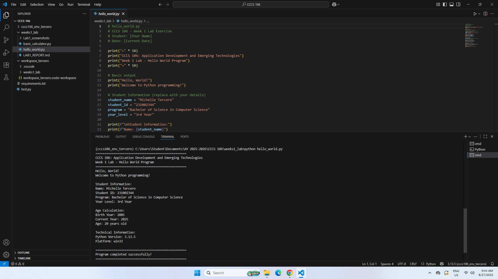

**Student Name:** [Michelle Tercero]
**Student ID:** [231002344]
**Section:** [A]
**Date:** [08/27/2025]

## Environment Setup

### Python Installation
- **Python Version:** [e.g., 3.11.5]
- **Installation Issues:** [NONE]
- **Virtual Environment Created:** ✅ cccs106_env_tercero

### VS Code Configuration
- **VS Code Version:** [e.g., 1.82.0]
- **Python Extension:** ✅ Installed and configured
- **Interpreter:** ✅ Set to cccs106_env_tercero/Scripts/python.exe

### Package Installation
- **Flet Version:** 0.28.3
- **Other Packages:** [List any additional packages]

## Programs Created

### 1. hello_world.py
- **Status:** ✅ Completed
- **Features:** Student info display, age calculation, system info
- **Notes:** [Any challenges or observations] [None]

### 2. basic_calculator.py
- **Status:** ✅ Completed
- **Features:** Basic arithmetic, error handling, min/max calculation
- **Notes:** [Any challenges or observations] [None]

## Challenges and Solutions

I faced a lot of challenges when making this virtual environment. At first, I got a bit confused about what to do next. Even though the instructions were provided, some things didn’t work on the first try. Thankfully, my classmate taught me how to fix those errors.

## Learning Outcomes

As for this activity, it was not easy for me because I got confused in some parts. It really requires patience, especially when encountering errors. Nevertheless, it was quite an enjoyable activity, especially once you finally finish it.
## Screenshots

## Environment set up

## VScode set up

## Hello world output

## Baic calculator output

